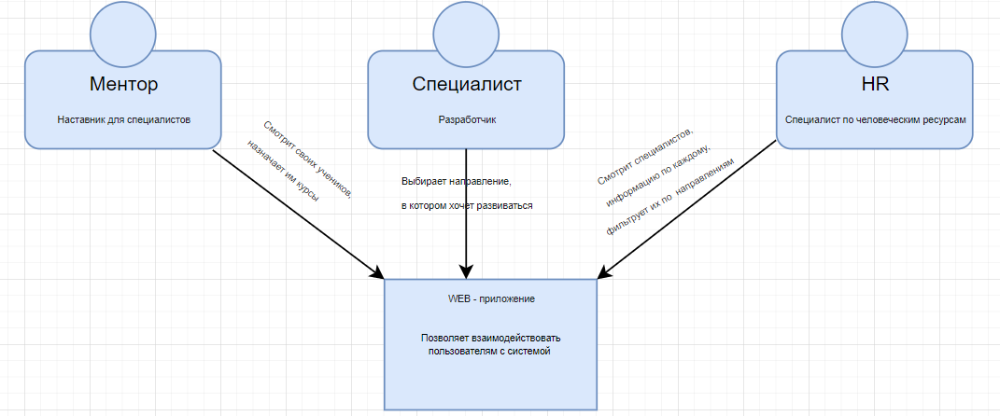
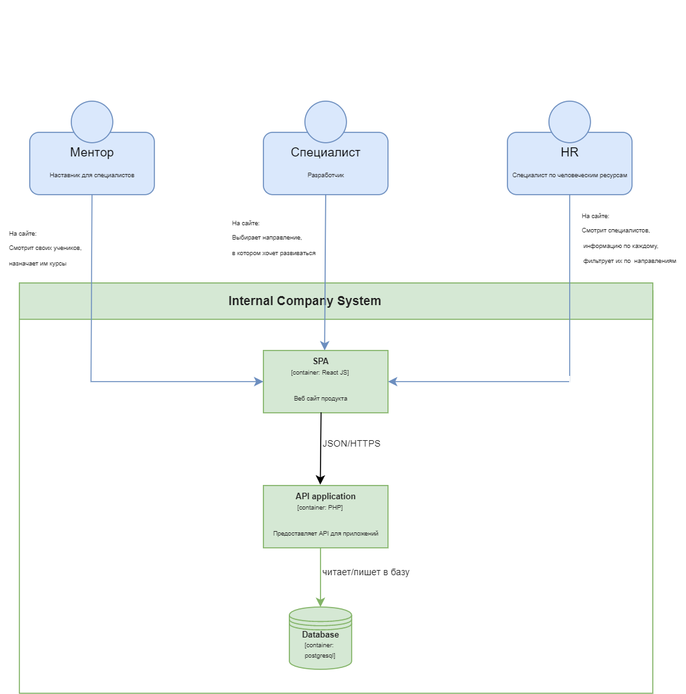
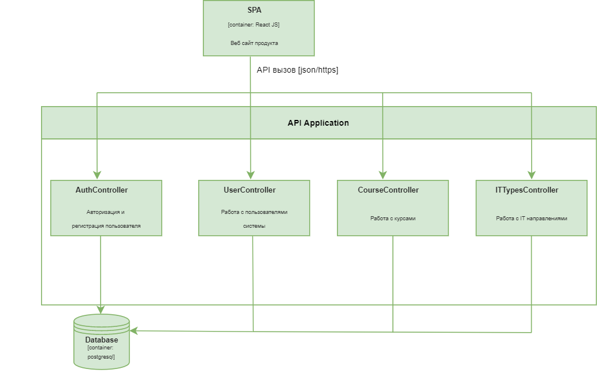
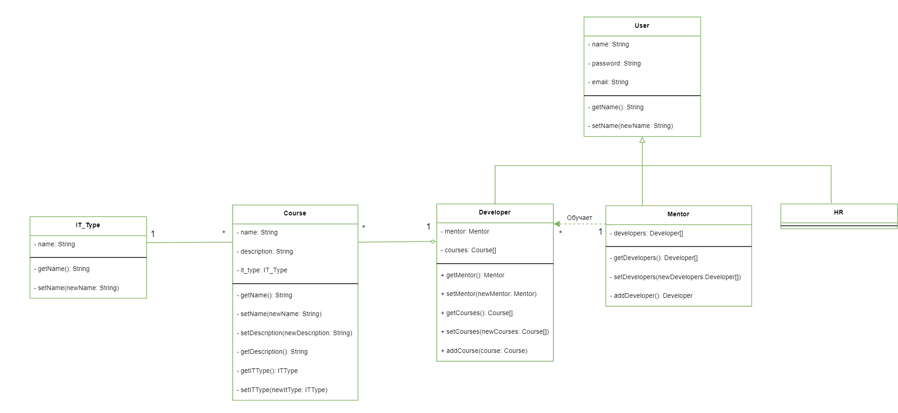
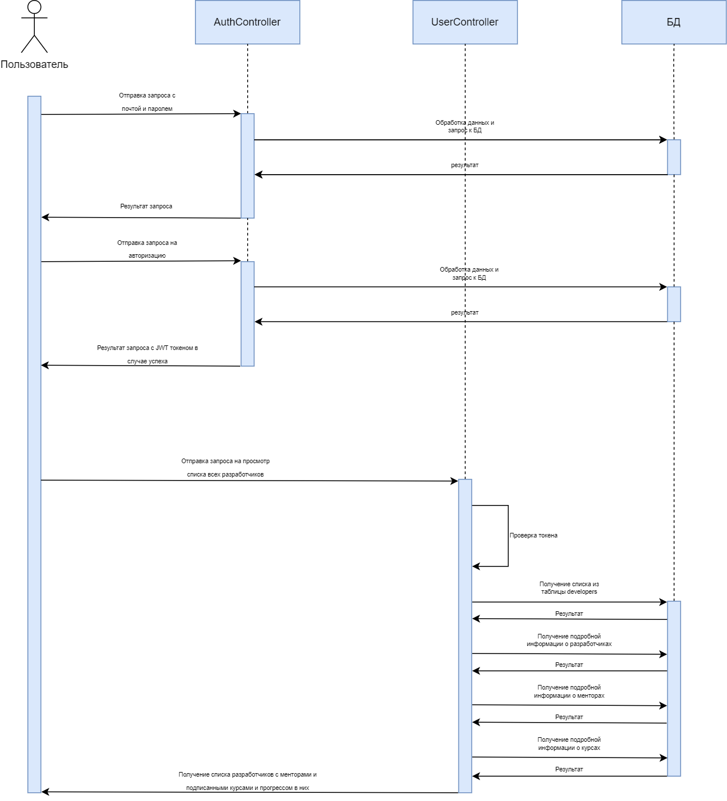
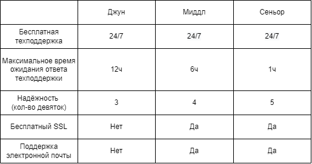

# HR - платформа

### Функциональные требования

<ul>
    <li>
        Пользователи имеют возможность зарегистрироваться и авторизоваться
    </li>
    <li>
        Ментор может назначать курсы своим ученикам
    </li>
    <li>
        Ментор может просматривать информацию об учениках и их прогрессе в разных курсах
    </li>
    <li>
        Специалист (ученик) может выбрать только ОДНО направление, в котором хочет развиваться 
    </li>
    <li>
        HR-ы видят специалистов и могут фильтровать их по направлениям
    </li>
</ul>

### Нефункциональные требования

<ul>
    <li>
        Система должна работать 24х7
    </li>
    <li>
        Допускается простой не более 5 часов в год
    </li>
    <li>
        Эксплуатационная пригодность   
    </li>
</ul>

### Системные требования

<ul>
    <li>
        Логирование всех запросов
    </li>
    <li>
        Трекинг действий пользователей на сайте
    </li>
    <li>
        Бэкап базы данных раз в трое суток   
    </li>
</ul>

### Архитектура решения в формате c4:

#### Уровень контекста:

#### Уровень контейнеров:

#### Уровень компонент:

#### Уровень кода:

#### Диаграмма последовательности:

### SLA:

###<i> Код для эмуляции лежит в корне - ‘start.js’ </i>
